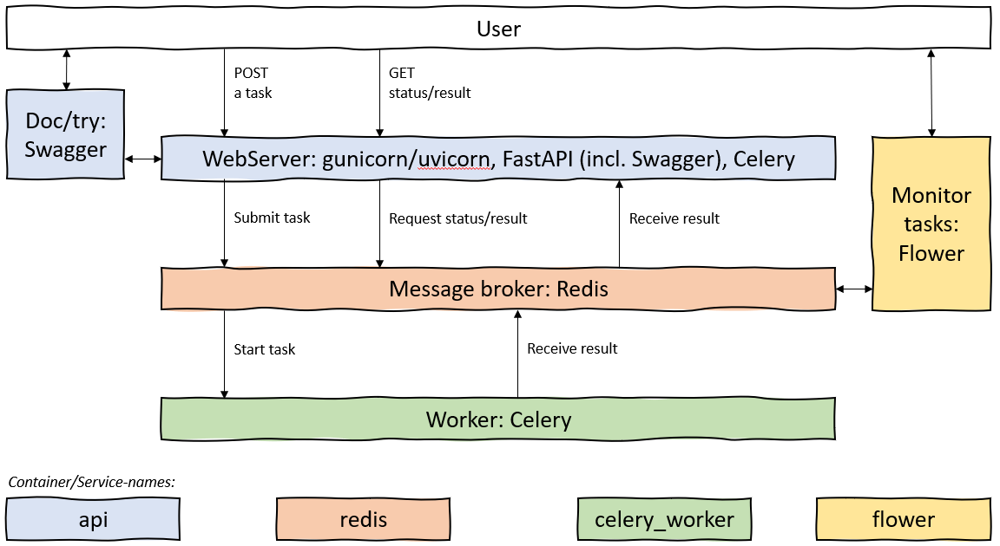

# WEB API with FastAPI, Celery and Redis

This project demonstrates how FastAPI, Celery, Redis can be used to put to gether services for deploying
heavy calculations.

**TOC**

* tldr;
* Project folders and files
* [Architecture](#Architecture)
* FastAPI Endpoints
* Make!
* Docker compose - different environments
* Celery - Multiprocessing
* Redis - Warnings and bindings
* Security
* Considerations / further work

## tldr;

Start services with:

```console
docker-compose -f docker-compose.yml -f docker-compose.dev.yml up --build -d --no-deps
```

or install **make** (Tip: use git bash) and run

```console
make buildup
```

from the root folder of this project.


This will start 4 services;

* the webapi - based on FastAPI
* the broker - based on celery
* backend - based on redis, and
* monitoring of backend - based on flower

After all services is up, you can go to

* [http://localhost/docs]() to read the automatic generated Swagger documentation and make requests to the
REST api endpoints
* [http://localhost:5555]() to monitor the backend, pending tasks etc.
* Do a request by using curl (tip: open your Git Bash - there you have curl) with:

```bash
curl -X 'POST' \
  'http://localhost/start_simple_task' \
  -H 'accept: application/json' \
  -H 'Content-Type: application/json' \
  -d '{
  "duration": 0,
  "a": 1,
  "b": 1,
  "wait": 1
}'
```

## Project folders and files

```bash
gen_api
│   .env                                     --> containing environment variables
│   docker-compose.dev.yml                   --> override for development environment
│   docker-compose.prod.yml                  --> override production environment
│   docker-compose.yml                       --> common docker compose for dev and prod environment
│   DockerfileCelery                         --> Dockerfile used for Celery and Flower services
│   DockerfileRedis                          --> Dockerfile used for Redis service
│   DockerfileWebapi                         --> Dockerfile used for Web API service
│   makefile                                 --> Makefile to make it easier to use docker-compose
│   readme.md                                --> This file
│   requirementsCelery.txt                   --> Python requirements used in Celery dockerfile
│   requirementsCelerydev.txt                --> Additional Python requirements used in development for Celery dockerfile (auto-reload on code change.)
│   requirementsWebapi.txt                   --> Python requirements used in Web api docker file
│   __init__.py
│
├───api
│   data_model.py                            --> Pydandic data models, defining input and output schemes for the web api
│   main.py                                  --> End points of the web api
│   worker.py                                --> Set up of the celery worker, with info on broker and backend from environment variables, defined in .env
│   __init__.py
│
├───celery
│   │   tasks.py                          --> definition of celery tasks, triggering different calculations in ./calc_models
│   │   worker.py                         --> hardlink to ../api/.worker.py
│   │   __init__.py
│   │
│   └───calc_models
│       calculate.py                      --> The calculation "models" are developed here.
│       __init__.py
│
├───redis
│       init.sh                           --> changed redis config (memory handling) and startup of redis
│       redis.conf                        --> (unchanged from default) redis config file.
│       sysctl.conf                       --> redis config, memory handling
│
└───_misc
        Services.PNG                      --> image embedded in this readme.md
```

## FastAPI - the endpoints


## Celery - Multiprocessing

## Docker compose - different environments

## Redis - Warnings and binding
When using the official image `redis:6.2-alpine` out of the box one get some warnings:
>WARNING overcommit_memory is set to 0! Background save may fail under low memory condition.

The files `./redis/init.sh` and `./redis/.sysctl.conf` handles this and sets `vm.overcommit_memory=1`.

>Warning: no config file specified, using the default config.

The file `./redis/redis.conf` is added so that you can add custom configs. The file used is the same as [this one](https://raw.githubusercontent.com/redis/redis/6.2/redis.conf).


## <a id="Architecture"> Architecture </a>

The following picture describes the flow between services:



## Theres a makefile here!

To make things a bit easier, using docker-compose the main functions are wrapped in a makefile:

```console
$ make help
usage: make target [arg=arg, *]

targets:
          help: this text
          build: build image(s), argument c and e available
          buildup: build image(s), create and start container(s), argument c, d, e available
          up: start container(s), argument c, d, e available
          start: start container(s), argument c and e available
          down: stop and remove container(s), argument c, e available
          stop: stop container(s), argument c, e available
          restart: same as make stop & make start in sequenze, argument c, d and e available
          logs: return logs of container(s), argument c and e available
          logs-api: return logs for api container, argument e available
          ps: list containers
          login-api: start interactive prompt for container api, argument e available
          login-celery_worker: start interactive prompt for container celery_worker, argument e available
          login-redis: start interactive prompt for container redis, argument e available
          Tip: leave login with command "exit" or ctrl-D

arguments:
          c: container name(s), usage: c=container_name or c="container1 container2 ..."
          d: run command detached or not, default is detatched, usage: d=false
             Detached mode: Run containers in the background
          e: which docker-compose environment file to use, default is docker-compose.dev.yml
             usage: e=prod to use docker-compose.prod.yml"

EXAMPLE:
          make buildup c="redis flower" d=false e=prod
          will build, create and start the container (in "undetatched mode") for redis and flower,
          using the docker-compose.yml with overrides from docker-compose.prod.yml
```

## Try your first post with

```bash
curl -X POST localhost/start_simple_task -H "Content-Type: application/json" -d '{"duration": 1, "a":2.0, "b":3}'
```

## Security

### Non-root users

Non-root users are running the services in the docker files, according to [this post](https://medium.com/@mccode/processes-in-containers-should-not-run-as-root-2feae3f0df3b).
In Docerfile(s), creating user with:

```dockerfile
RUN groupadd -g 999 appuser && \
    useradd -r -u 999 -g appuser appuser
```

And set user with:

```dockerfile
USER appuser
```

### Exposing only needed ports

The docker compose differ between ports that are open outside the container (host ports):

```yaml
ports:
   - 8080:8080
```

and ports that are only available to linked services:

```yaml
expose:
   - 5555
```

In the production environment, only the webapi and the flower services are available to the host machine.
In dev everything is exposed to the host, for debugging purposes.

## Considerations

* Consider to shange Dockerfile(s) so that pip install is not done by root, but instead create a virtual environment and install as normal user - less chance of messing up any python dependencies already in the image.
* Add ngingx on top of Gunicorn and add some ssl (https).
* Consider Redis Persistence to keep results, even though the service goes down: [](https://redis.io/topics/persistence)
* Consider adding different networks for the different services (nginx in front; api and flower in middle; redis and celery_worker in back)

## TODO (or consider)

* [ ] Finish this md